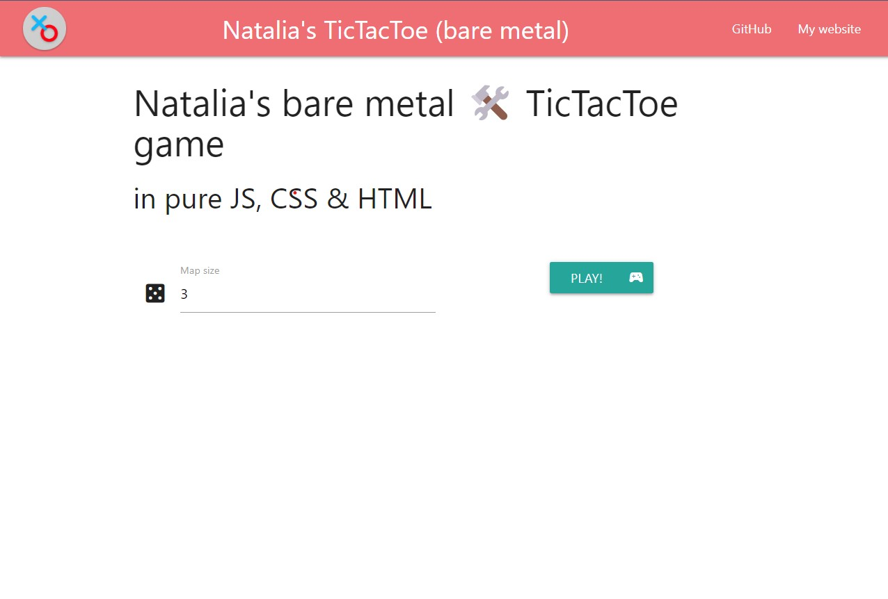
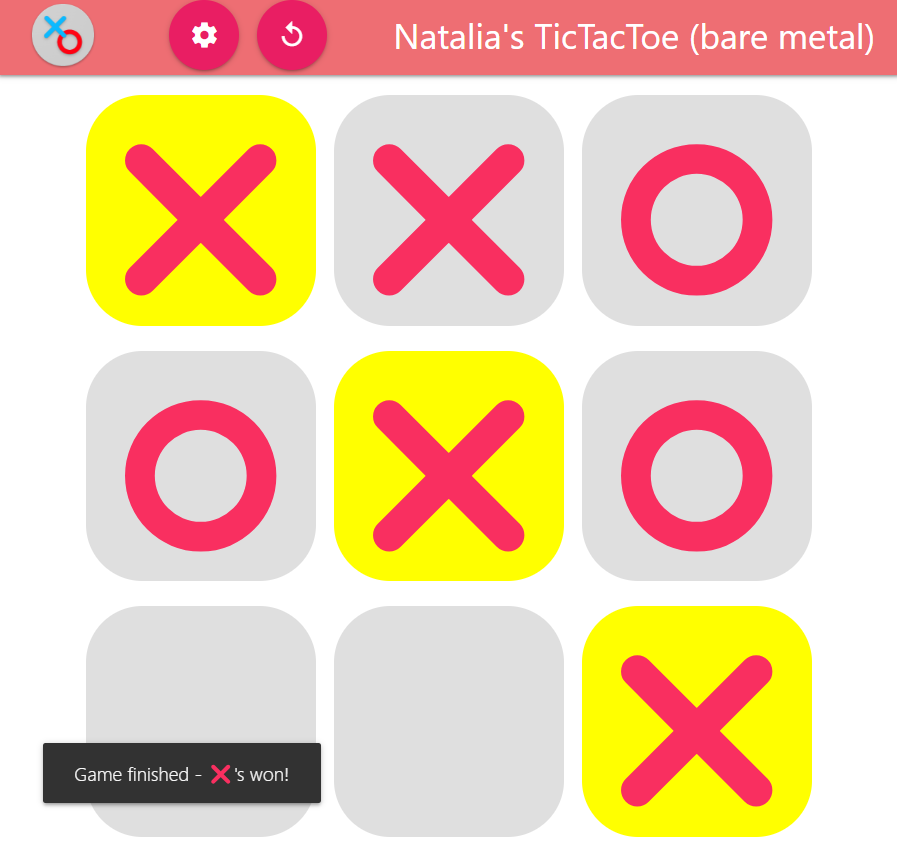
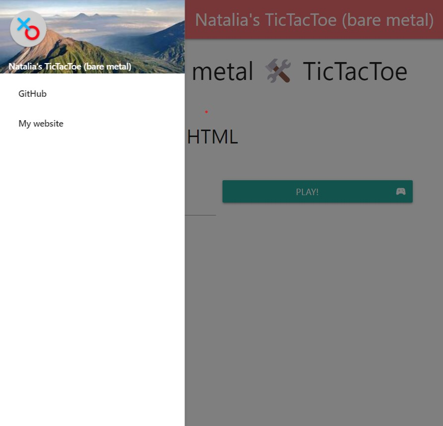
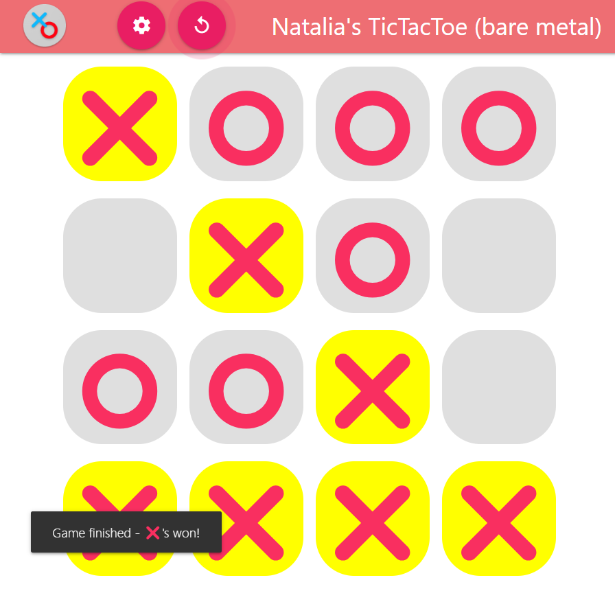

# Bare Metal React TicTacToe

📣🎉 Live demo: https://xintre.github.io/TicTacToe-web-bare-metal

|                         Responsive menu                          |      Responsive map   with winning sequence detection       |
| :--------------------------------------------------------------: | :-------------------------------------------------------------: |
|         |  |
|  |  |

## Table of Contents

- [Bare Metal React TicTacToe](#bare-metal-react-tictactoe)
  - [Table of Contents](#table-of-contents)
  - [Introduction](#introduction)
  - [Demo](#demo)

---

## Introduction

This is my bare-metal implementation of the TicTacToe game using pure HTML, JS & CSS with minimum external libraries:

- [materializecss](https://materializecss.com/) for Material Design UI components
- [immutable.js](https://immutable-js.com/) for Set / Map that support deep equality syntax, i.e. allow a Set to carry dicts that are compared by value rather than reference

This project is just a port of my original implementation of the [TicTacToe Jetpack Compose Android app](https://github.com/Xintre/TicTacToe).

## Demo

You can view the [live demo here](https://xintre.github.io/TicTacToe-web-bare-metal).
